# Notes on the SQL for Data Science [course](https://www.coursera.org/learn/sql-for-data-science/home/module/1)
#### *by Coursera, University of California, Davis*
> SQL (Structured Query Language )
* * *
  
 
## Module 1
### Relational database management system

***Column***: single field in a table \
***Row***: A record in a table

*Relational vs. Transactional Model*\
***Relational model***: Allows for easy querying and data manipulation in an easy, logical and intuitive way.\
***Transactional model***: Operational database- insurance claims within a healthcare database

### Data model building blocks
***Entity***: Person, place, thing or event. Distinguishable, unique and distinct\
***Attribute***: A characteristic of an entity \
***Relationship***: Describes the association among entities 

Types of cardinality
* One-to-many
* May-to-many (many instances of an entity that are related to many instances of another entity)
* One-to-one

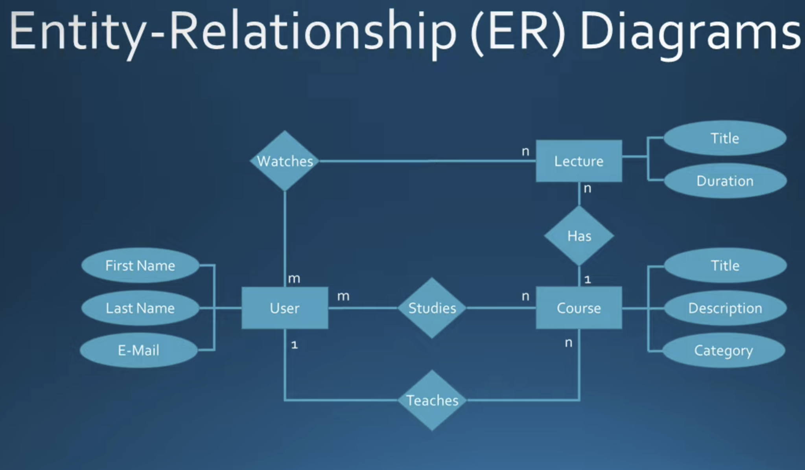

***Entities***: Userr, Course, Lecture\
***Attribute***: E.g. Title... \
***Relationship***: Studies, Teaches, Watches 

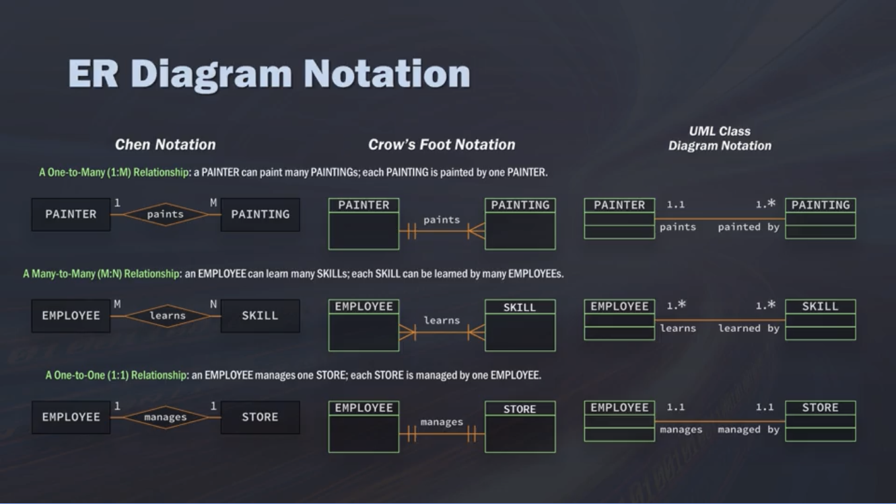

### Data modelling 
#### (click [here](https://www.red-gate.com/blog/data-warehouse-modeling-star-schema-vs-snowflake-schema) or [here](https://www.sqlitetutorial.net/sqlite-inner-join/) for more info)
> A denormalised database (classical tables as rows only), which could have a lot of duplication\
> Data is Normalised by creating other tables.\
>  Normalisation is a key difference between star and snowflake schemas.  The dimension tables in the snowflake schema are normalised.

* * *
  
 
## Module 2
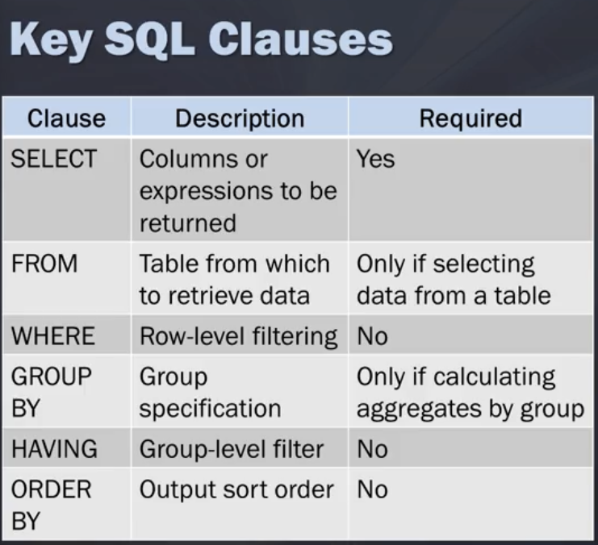

>**Where** filters before data is grouped (rows eliminated by the where clause will not be included in the group)\
> **Having** filters after data is grouped\
> **Order by** sorts data\
> **Group by** does not sort data\
>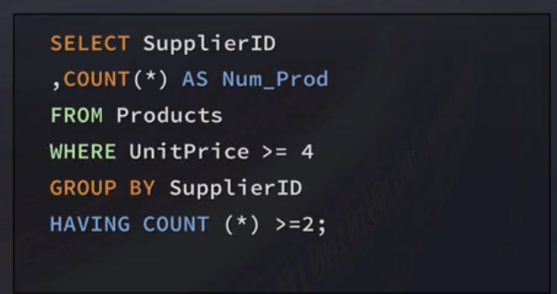

* [SUM](https://www.geeksforgeeks.org/sqlite/sqlite-sum-function/)
* [OR Operator](https://www.sqlitetutorial.net/sqlite-or-operator/)
* [DISTINCT](https://www.sqlitetutorial.net/sqlite-distinct/#:~:text=The%20DISTINCT%20clause%20is%20an,rows%20in%20the%20result%20set.&text=In%20this%20syntax%3A,immediately%20after%20the%20SELECT%20keyword.) clause
* [Order By](https://www.sqlitetutorial.net/sqlite-order-by/#:~:text=Introduction%20to%20SQLite%20ORDER%20BY%20clause&text=The%20ORDER%20BY%20clause%20comes,the%20ASC%20or%20DESC%20keyword.)
* [Group By](https://www.sqlitetutorial.net/sqlite-group-by/)
* [Exists](https://www.sqlitetutorial.net/sqlite-exists/)
* [Having](https://www.sqlitetutorial.net/sqlite-having/)

***SQL for Various Data Science Languages***
* [SQL for Python](https://pypi.org/project/python-sql/)
* [SQLite for Python](https://docs.python.org/3/library/sqlite3.html)
* [SQL for R](https://cran.r-project.org/web/packages/sqldf/sqldf.pdf)

* * *
  
 
## Module 3
Pre-qualify your names, try not to make unnecessary joins
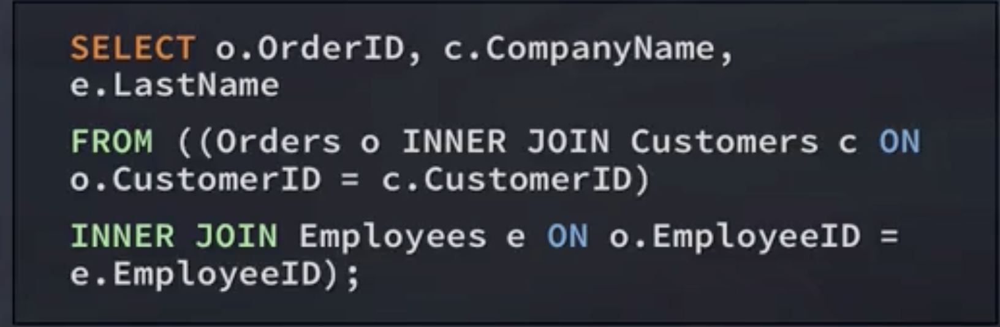

or use aliases\

**Self join**
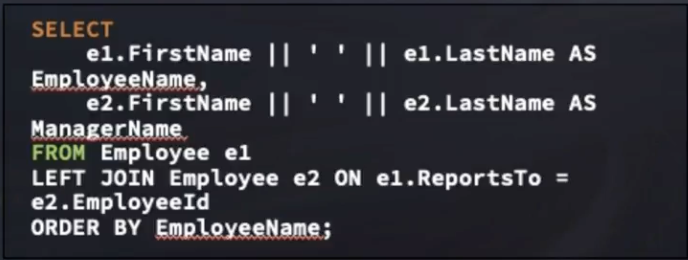

**Cross join** (Cartesian join)
* Each row from the first table joins with all the rows of another table
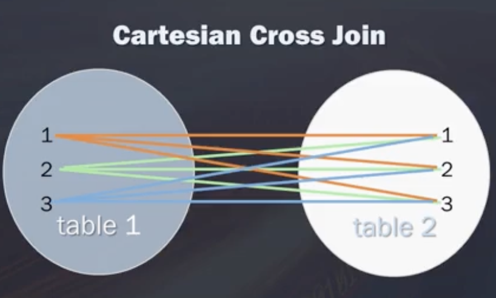

**Inner join**
* The inner join keyword selects records that have matching values in both tables
* [Inner Join](https://www.sqlitetutorial.net/sqlite-inner-join/)
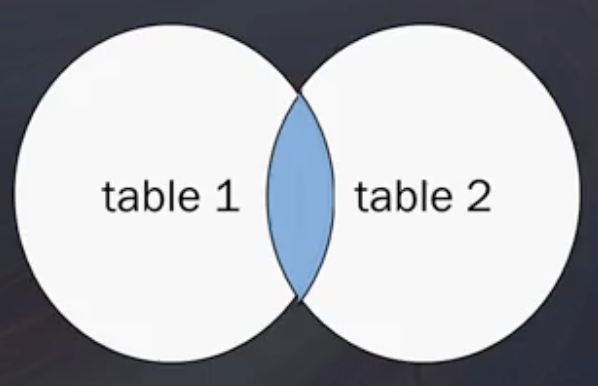

**Left join**
* Returns all records from the left table (table1), and the matched records from the right table (table 2).
* The result is NULL from the right side, if there is no match
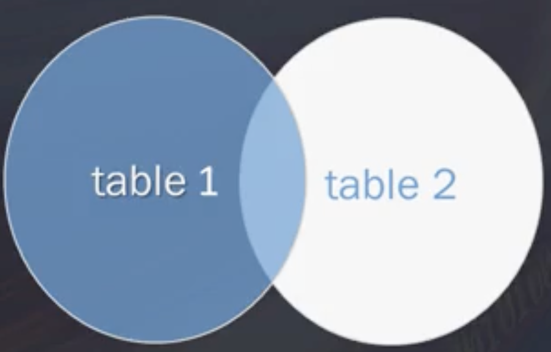

**Full outer join**
* Returns all records where there is a match in either the left (table 1) or the right (table 2) table records
* Basically, "give me everything"
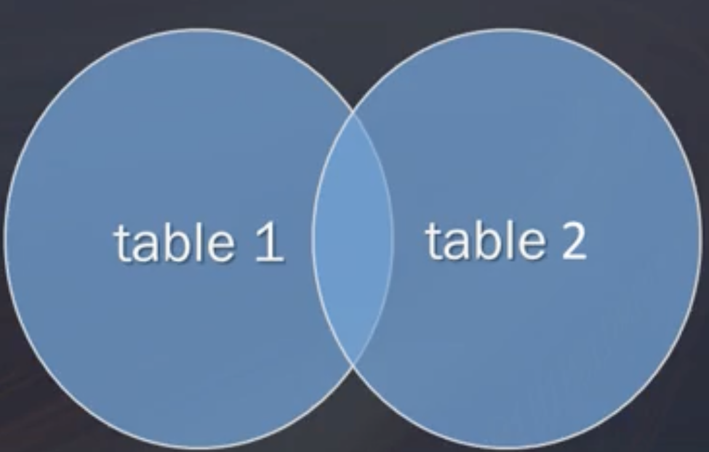
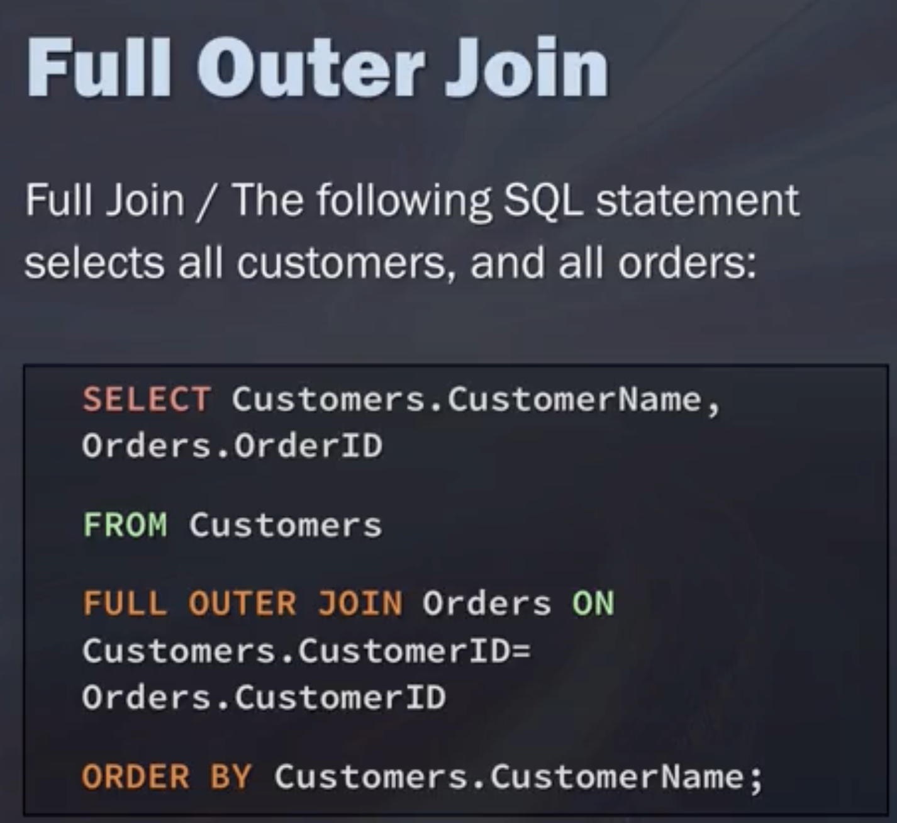

**UNION**
* The UNION operator is used to combine the result-set of two or more SELECT statements
* Each SELECT statement within UNION must have the same number of columns
* Columns must have similar data types
* The columns in each SELECT statement must be in the same order
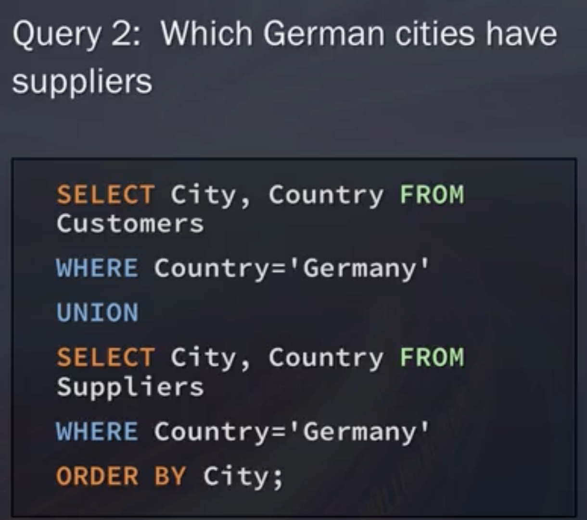

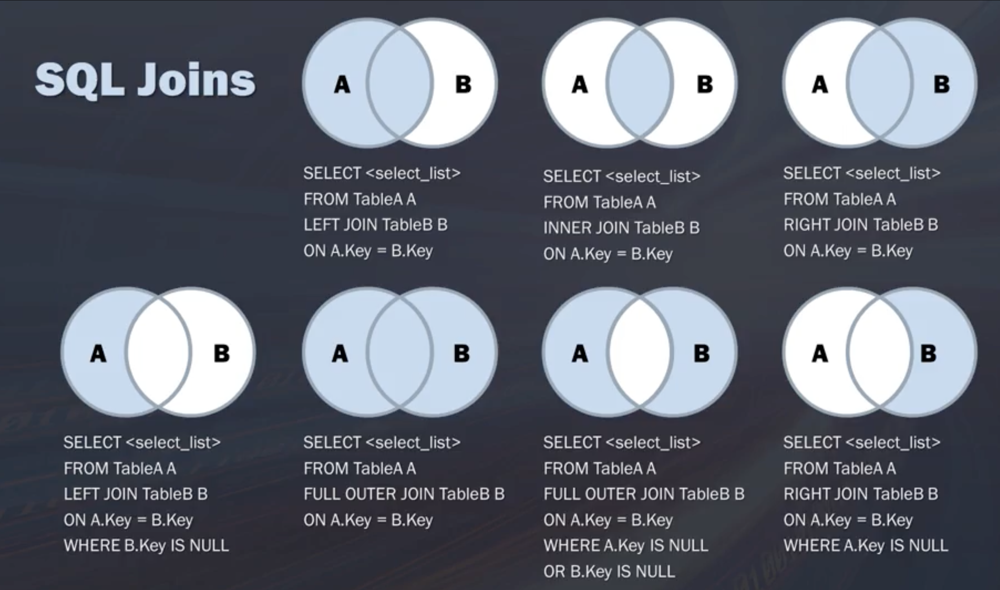

